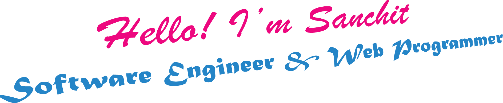

  

<h1 align="center">Hi there, I'm Sanchit Gupta 👋</h1>

  <i>Software Developer | AI & ML Enthusiast | Open Source Contributor | Tech Blogger</i>

---

## 🎯 About Me

- 🔭 Currently building cool things with **Python**, **React**, and **ML**.
- 🌱 Learning **Cloud (GCP)**, **DevOps**, and **Scalability**.
- 💬 Ask me about: **Web Dev**, **AI/ML**, **API Design**, **Data Pipelines**
- 📫 Reach me at: [sanchitgupta0101@gmail.com](mailto:sanchitgupta0101@gmail.com)
- 🧠 Fun Fact: I love converting ideas into scalable tech solutions 🚀

---

## 🧠 Skills & Tools 

### Programming Languages  

&nbsp;
&nbsp;
&nbsp;
&nbsp;
&nbsp;
&nbsp;

### Web & Frameworks  

&nbsp;
&nbsp;
&nbsp;
&nbsp;
&nbsp;
&nbsp;

### Databases & Cloud  

&nbsp;
&nbsp;
&nbsp;

### Dev Tools  

&nbsp;
&nbsp;
&nbsp;

### ML/DL Stack  

&nbsp;
&nbsp;
&nbsp;
&nbsp;

---

## 🏆 GitHub Trophies

  

---

## 📊 GitHub Stats

  
  
   
  

---

<h2 align="center">Snake eating my Contribution</h2>

---

## 📫 Connect With Me

  &nbsp;
  &nbsp;
  &nbsp;
  &nbsp;
  &nbsp;
  &nbsp;
  

---

  

